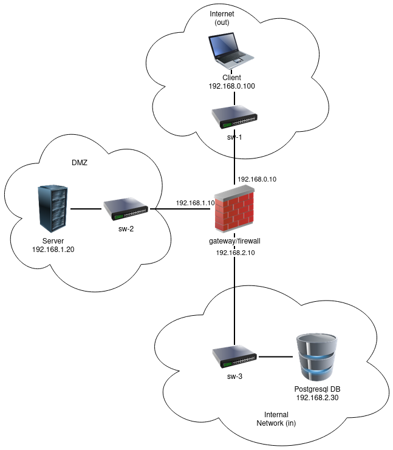

# A37 BombAppetit Project Readme

## Team

| Number | Name               | User                               | E-mail                                 |
| ------ | ------------------ | ---------------------------------- | -------------------------------------- |
| 99194  | Daniel Pereira     | <https://github.com/DaniPalma2002> | <mailto:danielppereira2002@tecnico.ulisboa.pt>      |
| 99315  | Ricardo Toscanelli | <https://github.com/rtoscanelli>   | <mailto:bob@tecnico.ulisboa.pt>        |
| 99328  | Simão Gato         | <https://github.com/SimaoGato>     | <mailto:simao.gato@tecnico.ulisboa.pt> |

## Contents

This repository contains documentation and source code for the _Network and Computer Security (SIRS)_ project.

The [REPORT](REPORT.md) document provides a detailed overview of the key technical decisions and various components of the implemented project.
It offers insights into the rationale behind these choices, the project's architecture, and the impact of these decisions on the overall functionality and performance of the system.

This document presents installation and demonstration instructions.

## Installation

To see the project in action, it is necessary to setup a virtual environment, with 3 networks and 4 machines.

The following diagram shows the networks and machines:

;

### Prerequisites

All the virtual machines are based on: Linux 64-bit, Kali 2023.3:

[Setup Virtual Environment](https://github.com/tecnico-sec/Setup/)

Clone the base machine to create the other machines, with the IP addresses and hostnames as shown in the above diagram:

[Virtual Network Setup](https://github.com/tecnico-sec/Virtual-Networking)

See the programming language and library versions used in the project in the [Additional Information Section](#additional-information).

Some machine configuration commands will require ssh enabled.


### Machine configurations

Inside each machine, use Git to obtain a copy of all the scripts and code.

```sh
git clone https://github.com/tecnico-sec/a37-daniel-ricardo-simao
```
Remind that the machines are configured as shown in the diagram above:
- VM1: User
- VM2: Gateway / Firewall
- VM3: Server
- VM4: Database

Next we have custom instructions for each machine.

#### Machine VM3

This machine runs the **Server** application.

Change to the directory with the scripts:
```sh
cd a37-daniel-ricardo-simao/Configuration
```

Change the permissions of the script:
```sh
chmod +x generateServerCredentials.sh
```

Run the script:
```sh
./generateServerCredentials.sh
```

Send to the user machine the server and CA certificates:
```sh
scp path/to/server.crt path/to/ca.crt <username of User VM>@<IP of User VM>:/path/to/a37-daniel-ricardo-simao/Configuration/
```

#### Machine VM1

This machine runs the **User** (CLI) application.

!! Make sure that the server and CA certificates are in the correct directory (Configuration).

Change to the directory with the scripts:
```sh
cd a37-daniel-ricardo-simao/Configuration
```

Change the permissions of the script:
```sh
chmod +x generateUserCredentials.sh
```

Run the script:
```sh
./generateUserCredentials.sh
```

#### Machine VM4

This machine runs the **Database** application.

#### Generating certificates for postgres, user and root (Certificate Authority):

Generate keys
```sh
openssl genrsa -out root.key
```

```sh
openssl genrsa -out server.key
```

```sh
openssl genrsa -out user.key
```

Create certificate request
```sh
openssl req -new -key root.key -out root.csr
```
```sh
openssl req -new -key server.key -out server.csr

 - Common Name (e.g. server FQDN or YOUR name) []:<ip of database vm>
```
```sh
openssl req -new -key user.key -out user.csr

 - Common Name (e.g. server FQDN or YOUR name) []:postgres
```

Create a database to be able to sign other certificates
```sh
echo 01 > root.srl
```

Self sign the root
```sh
openssl x509 -req -days 365 -in root.csr -signkey root.key -out root.crt
```

Sign the user and server with root certificate and key
```sh
openssl x509 -req -days 365 -in server.csr -CA root.crt -CAkey root.key -out server.crt
```
```sh
openssl x509 -req -days 365 -in user.csr -CA root.crt -CAkey root.key -out user.crt
```

Convert them to .pem format
```sh
openssl x509 -in root.crt -out root.pem
```
```sh
openssl x509 -in server.crt -out server.pem
```
```sh
openssl x509 -in user.crt -out user.pem
```

#### Setup of postgres server
```sh
sudo apt update
```
```sh
sudo apt install postgresql postgresql-client
```

```sh
sudo systemctl start postgresql
```
```sh
sudo -u postgres psql -c "ALTER USER postgres PASSWORD 'postgres';"
```
```sh
sudo -u postgres psql -c "CREATE DATABASE restaurantsdb;"
```
```sh
sudo systemctl enable postgresql
```

#### Enable SSL on PostgreSQL:
Go to postgresql main folder
```sh
sudo cd /etc/postgresql/16/main     # 16 is postgres version 
```

Copy server key, and root and server certificates to this folder
```sh
sudo cp /path/to/server.pem /path/to/server.key /path/to/root.pem .
```

Change file user to db user (postgres)
```sh
sudo chown postgres:postgres root.pem server.key server.pem 
```

Change server.key permissions
```sh
sudo chmod 0600 server.key
```

Open your PostgreSQL configuration file (`postgresql.conf`) and set the following parameters:
```sh
listen_addresses = '*'                  # what IP address(es) to listen on;

ssl = on
ssl_cert_file = '/path/to/server.pem'     # Path to your server certificate
ssl_key_file = '/path/to/server.key'      # Path to your server private key
ssl_ca_file = '/path/to/root.pem'         # Path to your root certificate 
```

Modify the `pg_hba.conf` file to allow SSL connections to server ip (make sure the ip is the same as below, or adapt it to your network)
```sh
hostssl	restaurantsdb	postgres	192.168.1.20/24		scram-sha-256	clientcert=verify-full
```

Restart postgres
```sh
sudo systemctl restart postgresql
```

Verify logs to see if its running properly
```sh
sudo cat /var/log/postgresql/postgresql-16-main.log
```

#### Connect to the database remotely:

change user.key to user.key.pk8
```sh
openssl pkcs8 -topk8 -outform DER -in user.key -out user.key.pk8 -nocrypt
```

Send user key and certificate, and root certificate to the grpc server
```sh
scp /path/to/user.pem /path/to/user.key.pk8 /path/to/user.key /path/to/root.pem <server vm user>@<server vm ip>:$HOME/
```

To test if everything works, access postgres shell remotely from the terminal on the application server VM (VM3 in our configuration)
```sh
psql "host=<db vm ip> user=postgres dbname=restaurantsdb sslcert=user.pem sslkey=user.key sslrootcert=root.pem sslmode=verify-full"
```

#### Populate Database manually
```sh
sudo -u postgres psql -d restaurantsdb
```
Paste the information on the ***populate.sql*** file into the *postgres terminal*.


### Machine VM2

This machine runs the **Firewall** application.

After every other machine is setup up, is time to add the firewall configurations.
Make sure that you have access to the iptables command.

Add the following rules to the firewall:
```sh
# Drop all incoming packets by default
sudo iptables -F
sudo iptables -t nat -F
sudo iptables -P FORWARD DROP
sudo iptables -P INPUT DROP
sudo iptables -P OUTPUT DROP

# Allow all outgoing packets
sudo iptables -A FORWARD -p tcp -m state --state ESTABLISHED -j ACCEPT

# Allow all packets from the outside network to the application server
sudo iptables -A FORWARD -i eth0 -p tcp -d 192.168.1.20 --dport 5000 -m state --state NEW -j ACCEPT

# Allow all packets from the application server to the database server
sudo iptables -A FORWARD -i eth1 -p tcp -s 192.168.1.20 --sport 5000 -d 192.168.2.30 --dport 5432 -m state --state NEW -j ACCEPT
```

## Demonstration

Now that all the networks and machines are up and running, ...

_(give a tour of the best features of the application; add screenshots when relevant)_

```sh
$ demo command
```

_(replace with actual commands)_

_(IMPORTANT: show evidence of the security mechanisms in action; show message payloads, print relevant messages, perform simulated attacks to show the defenses in action, etc.)_

This concludes the demonstration.

## Additional Information

### Links to Used Tools and Libraries

- [Java 17.0.8](https://openjdk.java.net/)
- [JDK 17.0.8](https://openjdk.java.net/)
- [Maven 3.8.0 +](https://maven.apache.org/)
- [PostgreSQL 16.1](https://www.postgresql.org/)

### Versioning

We use [SemVer](http://semver.org/) for versioning.

### License

This project is licensed under the MIT License - see the [LICENSE.txt](LICENSE.txt) for details.

---

END OF README
