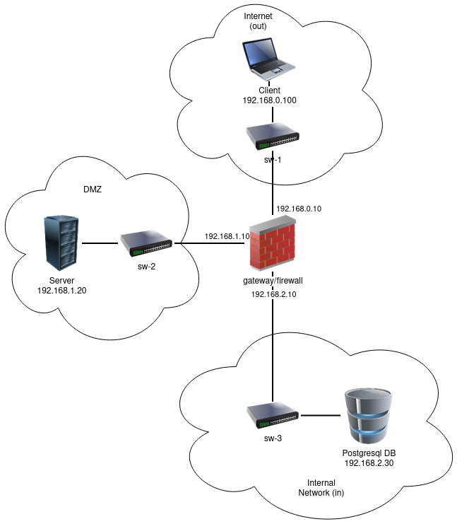

# A37 BombAppetit Project Report

## 1. Introduction

This project aims to develop a restaurant and tourism application that allows users to search for restaurants and get information about them. The application also allows users to give discount vouchers to other users and make reviews about restaurants. The application is composed by:
- Client
- Server
- Database

The client is a command line interface (CLI) that allows users to interact with the application.
The server is a gRPC server that receives requests from the client and interacts with the database.
The database is a PostgreSQL database that stores the information of the application.

The application is composed by two main components:
- Secure Document Format
- Infrastructure

The secure document format is a JSON format that stores the information of the restaurants and vouchers. This format is protected using a custom cryptographic library that was developed for this project.
The infrastructure is composed by a secure network and machines that allow the application to run.

In this project we were faced with a security challenge that required us to extend the secure document format and the infrastructure. The challenge required us to implement a secure mechanism to allow users to make reviews about restaurants and give vouchers to other users.

To test our system we simulate its use with 3 Users, and 2 restaurants.

### System Architecture:



## 2. Project Development

### 2.1. Secure Document Format

#### 2.1.1. Design

##### Implementation Design Proposal:

1. Protect Operation:

   - Symmetric Key Generation:
     - Generate a secure symmetric key for encrypting the voucher information.
   - Cipher Voucher:
     - Encrypt the voucher information using the generated symmetric key.
   - Cipher Symmetric Key:
     - Encrypt the symmetric key using the public key of the user, ensuring only the user can decrypt it.
   - Nonce Integration:
     - Include a nonce (combination of timestamp + random number) to prevent replay attacks.
   - Digital Signature:
     - Sign the entire document using the private key of the restaurant owner.

2. Check Operation:

   - Nonce Verification:
     - Check and validate the nonce to prevent replay attacks.
   - Digital Signature Verification:
     - Verify the digital signature using the public key of the restaurant owner to ensure authenticity.
   - Return Status:
     - Return a boolean indicating the success or failure of the digital signature and nonce verification.

3. Unprotect Operation:
   - Symmetric Key Decryption:
     - Decrypt the symmetric key using the user's private key.
   - Voucher Decryption:
     - Decrypt the voucher information using the decrypted symmetric key.
   - Remove Security:
     - Remove all cryptographic protection, leaving the original document intact.

##### Proposed Flow:

1. Protect:
   - Input: Original document, restaurant owner's private key, user's public key.
   - Output: Protected document.
2. Check:
   - Input: Protected document, restaurant owner's public key.
   - Output: Boolean status indicating authenticity and nonce validity.
3. Unprotect:
   - Input: Protected document, user's private key.
   - Output: Original document.

##### Chosen Algorithms:

1. Symmetric Key Generation:

- Algorithm:
  - AES (Advanced Encryption Standard)
- Key Size:
  - 256 bits
- Rationale:
  - AES is a well-established and widely accepted symmetric encryption algorithm known for its security and efficiency. The choice of a 256-bit key size aligns with contemporary security standards, providing a robust foundation for protecting the generated symmetric key.

2. Cipher Voucher(symmetric):

- Algorithm:
  - AES in GCM (Galois/Counter Mode)
- Rationale:
  - GCM offers a combination of confidentiality and integrity through authenticated encryption. The use of AES in GCM mode, with a unique IV for each voucher, ensures the security of the voucher information. This mode is particularly suitable for scenarios where both confidentiality and data integrity are crucial.

3. Cipher Symmetric Key (asymmetric):

- Algorithm:
  - RSA (Rivest-Shamir-Adleman) with SHA256
- Key Size:
  - 2048 bits
- Rationale:
  - RSA is employed for digital signatures due to its capability to provide a secure and efficient means of ensuring the authenticity and integrity of the entire document. The use of SHA256 as the hashing algorithm enhances the security of the digital signature, providing resistance against collision attacks and contributing to the overall robustness of the system.

4. Digital Signature:

- Algorithm:
  - RSA (Rivest-Shamir-Adleman)
- Key Size:
  - 2048 bits
- Rationale:
  - RSA for digital signatures provides a robust mechanism for ensuring the authenticity and integrity of the entire document.
  
##### Choosing Time window for nonce:

Determining the appropriate time window involves a trade-off between security and usability. We made some reasonable assumptions and calculations to arrive at a recommendation:

Assumptions:
1. The network delay and clock differences between the sender and receiver are minimal.
2. Legitimate messages typically arrive within a few seconds of generation.
3. The goal is to minimize the risk of replay attacks while avoiding unnecessary rejection of legitimate messages.

Calculation Steps:

- Estimate Network Delay:
  Assume a conservative network delay of up to 5 seconds.

- Consider Clock Drift:
  Assume a clock drift of up to 2 seconds between the sender and receiver.

- Calculate Total Tolerance:
  Network Delay + Clock Drift = 5 seconds + 2 seconds = 7 seconds.

- Set Time Window:
  Considering the total tolerance, set the time window to be slightly higher than the calculated total tolerance to accommodate variations.
  Recommended Time Window = 8-10 seconds.

##### Additional Considerations:

1. Key Size Considerations:
   The chosen key sizes (256 bits for symmetric key and 2048 bits for RSA) align with contemporary security recommendations. These sizes provide a balance between security and performance, catering to the specific needs of each cryptographic operation.

2. Security and Standardization:
   The chosen algorithms (AES, RSA) are well-established, widely used, and subject to rigorous scrutiny within the cryptographic community. This reliance on established standards enhances the overall security posture of the document protection mechanism.

3. Algorithm Compatibility:
   The selection of AES for symmetric key generation and encryption, combined with RSA for asymmetric operations, ensures compatibility and interoperability, allowing for seamless integration into the overall security framework of the document format.

4. Unique symmetric keys:
   For each communication it is used a different nonce and symmetric key.
 
##### What the Implementation Protects From:

1. Tampering and Forgery:

   - The digital signature ensures the authenticity of the document. Any tampering attempts will be detected during the check operation.

2. Unauthorized Access to Voucher Information:

   - The symmetric key used to encrypt the voucher is itself encrypted with the user's public key. Only the intended user with the corresponding private key can access the voucher information.

3. Replay Attacks:
   - The inclusion of a nonce, a combination of timestamp and a random number, prevents replay attacks. The check operation verifies the freshness of the nonce to ensure that the document is recent.

##### Guarantees Provided by the Implementation:

1. Confidentiality:

   - The voucher information is encrypted using a symmetric key, and the symmetric key itself is encrypted with the user's public key. This guarantees that only the intended user can decrypt and access the voucher details.

2. Authenticity:

   - The digital signature ensures the authenticity of the document. The check operation verifies the signature using the restaurant owner's public key, providing confidence in the origin of the document.

3. Integrity:

   - The hashing of the entire document before applying the digital signature ensures that the document has not been altered. Any modification would result in a mismatch during the signature verification.

4. Non-Repudiation:

   - The digital signature, coupled with the use of private and public keys, provides non-repudiation. The restaurant owner cannot deny their association with the signed document.

5. Freshness:
   - The nonce, incorporating a timestamp and a random number, guarantees freshness. This prevents replay attacks by ensuring that the document is recent and hasn't been reused.

##### Example Data Format:

```json
{
  "restaurantInfo": {
    "owner": "Maria Silva",
    "restaurant": "Dona Maria",
    "address": "Rua da Gl??ria, 22, Lisboa",
    "genre": ["Portuguese", "Traditional"],
    "menu": [
      {
        "itemName": "House Steak",
        "category": "Meat",
        "description": "A succulent sirloin grilled steak.",
        "price": 24.99,
        "currency": "EUR"
      },
      {
        "itemName": "Sardines",
        "category": "Fish",
        "description": "A Portuguese staple, accompanied by potatoes and salad.",
        "price": 21.99,
        "currency": "EUR"
      },
      {
        "itemName": "Mushroom Risotto",
        "category": "Vegetarian",
        "description": "Creamy Arborio rice cooked with assorted mushrooms and Parmesan cheese.",
        "price": 16.99,
        "currency": "EUR"
      }
    ],
    "mealVoucher": {
      "encryptedVoucher": "<...>",
      "encryptedSymmetricKey": "<...>",
      "nonce": "<...>"
    }
  },
  "signature": "<...>"
}
```

#### 2.1.2. Implementation

This project was developed using **Java** to program it with **Maven** as a build automation tool.
The communications between machines are established by using remote procedure calls with **gRPC**, with **TLS** to secure the communication.
The database was implemented with **PostgreSQL**.

The cryptographic libraries we used are:

- java.security.\*
- javax.crypto.\*
- javax.crypto.spec.\*
- java.util.Base64
- com.google.gson.\*

We got a good planning of the secure library, so the implementation of the library was actually pretty smoothed. The idea we had for the infrastructure also make it easier for us to understand.

### 2.2. Infrastructure

#### 2.2.1. Network and Machine Setup

The infrastructure architecture is composed by an internal secure network that secures the system's database, protected with a firewall that is used to implement a DeMilitarized Zone (DMZ). The latter is composed by the application public server which can be connected by users of the project service.
These users, located in external networks, connect to the infrastructure via the internet. To test the system, this connection was simulate by using a virtual machine (VM1) that is connected to the application server via a virtual network interface, different from the one used by the other machines.

The system is implemented as following:


- VM1: External **user machine** that connect to the application server on port 5000
- VM2: **Gateway** machine which separates the external network from the DMZ and internal network. A single firewall is used to accomplish this separation.
- VM3: **Application server** machine that receives connections from external users. It is connected to the database server on port 5432.
- VM4: **Database** server machine that stores the information of the system. It can only be accessed via the application server.

The firewall configuration is composed by a set of rules that allow the communication between the machines of the infrastructure. The firewall is configured to block all incoming connections, except the ones that are allowed by the rules. The firewall is also configured to block all outgoing connections, except the ones that are allowed by the rules:
- Rule 1: Allow all new external connections to the application server on port 5000
- Rule 2: Allow all new connections from the application server to the database server on port 5432
- Rule 3: Allow all previous established connections
- Block everything else.

If a system administrator wants to update the system, he might have to allow new connections from the server to the internet. This can be done by adding a new rule to the firewall that allows the new connections.
This rule can later be removed after the update is completed, for security reasons.

#### 2.2.2. Server Communication Security

In order to establish a communication between users and the application server, a secure channel was implemented using **TLS**, on top of **gRPC**. This channel is used to protect the confidentiality and integrity of the data exchanged between the two parties.
This secure channel was also used in the communication between the application server and the database.
These channels were tested with the **Wireshark** tool, which allowed us to verify that the data exchanged between the parties was encrypted.

(_Explain what keys exist at the start and how are they distributed?_)

In this project's scenario is assumed that all users know a priori the public keys of the application server and vice-versa.

A **Certificate Authority (CA)** was used to generate the certificates used in the secure channels. The CA was implemented using the **OpenSSL** tool, which allowed us to generate the certificates and the private keys for each server.
All certificates were signed by the CA, which allowed us to establish a secure communication between the parties.
The users (clients), to connect to the server, must first know the server's certificate. This certificate is sent to the client before the server starts, and the client must trust it in order to establish a secure connection.
The share of the server's certificate, in a real world scenario, can be done by a system administrator, which must send/install the certificate to the users machines before they can connect to the server.

To establish a connection between the application server and the database, certificates are generated and signed by a root certificate. This root certificate is used to sign the certificates of the application server and the database server. This allows the application server to trust the database server, and vice-versa.
To simplify the process of generating the certificates, all certificates are generated in the same machine and then sent via *scp* to the respective servers.

### 2.3. Security Challenge

#### 2.3.1. Challenge Overview

In response to the Security Challenge, two new requirements have been introduced, significantly impacting the original design of the document protection mechanism:

- Users are now allowed to make reviews about restaurants. Other users need to validate the authenticity of the person who wrote the reviews. To address this, a mechanism was devised to sign and authenticate reviews securely.
- Users can now give vouchers to other users, leading to a modification in the structure of the JSON format. Instead of a single voucher, users can have multiple vouchers for the same restaurant. The challenge involves efficiently handling multiple vouchers, ensuring their security, and enabling secure transfers.

#### Assumption

Users trust the server never fails and never fools. Users are confident that the reviews sent by the server are authenticated by the respective authors. Reviews are sent to the server when created.

1. Reviews
   The design for reviews focused on two distinct approaches to satisfy the challenge requirements:

- Include Complete JSON: When a user wants to make a review, they add the review details to the complete JSON and send it back to the server. The entire JSON is signed using the protect method of the secure document library, allowing the server to authenticate the review.
- Send Only Review: Alternatively, users can send back only the review details instead of the complete JSON. This option would require additional methods in the secure document library and impose an overhead on the server.

However, to minimize programming costs and ensure simplicity, the first option was chosen. Potential concerns about malicious clients flooding the system with reviews were addressed by allowing only one review per request on the client side.

1. Giving vouchers
   The introduction of the ability for users to have multiple vouchers for the same restaurant necessitated a reevaluation of the JSON format. A strategic decision was made to transition from a singular "mealVoucher" structure with two fields (code and description) to a more versatile "mealVouchers" format, represented as a list of codes and descriptions.

```json
{
  "restaurantInfo": {
    "mealVouchers": [
      {
        "code": "VOUCHER123",
        "description": "Redeem this code for a 20% discount in the meal. Drinks not included."
      }
    ]
  }
}
```

This transition allows users to possess multiple vouchers for a specific restaurant, enabling a more dynamic and extensible voucher management system.

Ciphering Strategy
The critical decision then was whether to cipher the entire list of vouchers as a unit or individually cipher each voucher. The chosen approach was individual ciphering for each voucher. The rationale behind this decision was twofold:

1. Selective Voucher Protection:
   By opting to protect vouchers individually, the system gains the flexibility to secure only specific vouchers. This becomes crucial when a user wishes to use or transfer a particular voucher without affecting others.

2. Efficiency and Performance:
   Individual ciphering simplifies the process of managing vouchers. It aligns with the practical use case where a user may interact with a subset of vouchers rather than the entire list.

The final ciphered document now, looks like this:

```json
{
  "restaurantInfo": {
    "owner": "Maria Silva",
    "restaurant": "Dona Maria",
    "address": "Rua da Glória, 22, Lisboa",
    "genre": ["Portuguese", "Traditional"],
    "menu": [
      {
        "itemName": "House Steak",
        "category": "Meat",
        "description": "A succulent sirloin grilled steak.",
        "price": 24.99,
        "currency": "EUR"
      },
      {
        "itemName": "Sardines",
        "category": "Fish",
        "description": "A Portuguese staple, accompanied by potatoes and salad.",
        "price": 21.99,
        "currency": "EUR"
      },
      {
        "itemName": "Mushroom Risotto",
        "category": "Vegetarian",
        "description": "Creamy Arborio rice cooked with assorted mushrooms and Parmesan cheese.",
        "price": 16.99,
        "currency": "EUR"
      }
    ],
    "reviews": [
      {
        "user": "John Doe",
        "rating": 4,
        "comment": "Great food and excellent service!"
      },
      {
        "user": "Emily Brown",
        "comment": "Not bad, but nothing extraordinary either.",
        "rating": 3
      }
    ],
    "mealVouchers": [
      {
        "encryptedVoucher": "rDJewGbMfBXjKaytP791vVrIB3oR8cfGBt5QLSDswQQRVuOPd863O8fWJ+LCMHJ1fPNBGBEjKGlvjTaspuAkokxjw/cU67FGbDYCtdpRtg9VQun3YI0SB9qCDJzWwNXrG0lnb+vEC7PvrpGFCD/V+v4C9gzUky7NwR3n",
        "iv": "8feWjLnkNXyGzF5t"
      },
      {
        "encryptedVoucher": "joomeugil9GmaA7Fz9sPWitz74scjSkuuidWugH1nybV4GBLv5nSaWpwo+xalt96+IomYRZ3pHOvA3yYnQ6242AqO8rJN5nHds8PnuGHViICdZ/mLacITb/LYj3dU9iYz+MuoUPbcT3rA2aEpWB+qFFz7e/b",
        "iv": "OLDZqpcHtOZ7A8c3"
      }
    ],
    "encryptedSymmetricKey": "Fbq1GueA5DWojR+0eikj3eWMii19s2zqRQeL8xIJdJvJDKsk8Hu/f4R/7zCmrMqACFd21Hl8saUeMZF9y5L3EdO48LXR5Q1mBZhIZDmmjZgP7n+ECQlXAVGw7HCEzlkkZv4BqR+GRpErQflVWewVSAFwJoV/2s/Ccv09Bi2YIpm3kRhCC+LkvItSt3QquJWRI1awc5cqHL9kWfyZPodN19A4Tlf8dIrx7WwTPTKl7tx+opvEagMEDW5bwQ6qy3u4WeCoQmEEodNMLWO+yyFAKZTtXzruK2jgviOa3+cAsneDxmVHJwLDbcohHzJYQsoxutfjFa7ZGROxDpJhXy5V8w\u003d\u003d",
    "nonce": "1702911552676 ct7ydlz/G8lOOX3z"
  },
  "signature": "lwU34aKUbW/vMf03sSsLG70z2LCL/QihSziJNvIweJPjM26VOBajKqnjC4Oz8MfFfb63ZkL2KZIHXw7tzRnxcqpZF8/MGQcVWDJV6NW9YibNItPCnxBMMqRanD/+Ve429h6hdjWDqIfcbObf4j1br+KEYhv02eAztLY1ctahp/ao8XmyI671vP+rYmRhstGEQ7vPLSdi8ALRwl8Yt6u39fuznLfdwkvRh3W8gzgUM+Szch1SdY/0zsIizgYGBKF3aswAMJSnj6BDhy9jZtyAtkvDYGp+xetZ3yaOL4E3pBgJykjQDbhFq8U5HGsRc1UnfCPkmLsz5yuRBI3GujiM3A\u003d\u003d"
}
```

This refined approach enhances the security and manageability of vouchers, aligning with the evolving needs of the system.

#### 2.3.2. Attacker Model

In this system we consider the users might not be fully trusted. The server is partially trusted since is public accessed, and so belongs to the DMZ. The database is fully trusted since it is only accessed by the server, in the internal network. 

In this system with the implementation of the secure document library, we consider that the attacker can only impersonate an user if it knows the user's private key.
The attacker can sniff the network traffic, but cannot decrypt the critical information (e.g. user vouchers) since is encrypted with private keys.
Also, the attacker cannot modify the information in the network traffic since it uses digital signatures, and so the server/user applications will deny the information, if tampered.
Even though the attacker might perform a denial of service (DNS) in the application server machine, the information is safely stored in the database, since it can only be accessed by the server with only one connection.
The database data is not encrypted, and so, if an attacker has administrator privileges in the database server or internal network, it can access all the system information.

#### 2.3.3. Solution Design and Implementation

In response to the Security Challenge, our team strategically leveraged existing key distribution measures integral to our initial solution. The cornerstone of our approach lies in the implementation of hybrid ciphering for vouchers, a measure implemented from the project's inception.

Key Distribution Measures:

1. Hybrid Ciphering for Vouchers:

- Symmetric Key Generation: At the core of our solution is the generation of a secure symmetric key for each voucher.
- Ciphering Process: This symmetric key is then encrypted using the public key of the intended recipient, adhering to the assumption that both restaurants and clients possess mutual knowledge of each other's public keys.

#### Security Measures:

While maintaining the existing key distribution measures, our team ensured a seamless extension to accommodate the new requirements introduced by the Security Challenge.

Key Design Considerations:

1. Mutual Knowledge Assumption:
   Reciprocal Key Exchange: The assumption that both restaurants and clients have knowledge of each other's public keys forms the basis for successful key distribution. This mutual knowledge ensures a secure and efficient channel for communication.

Communication entities and exchanged messages:
- gRPC Request: User ----> Server -----> Database
- gRPC Response: User <---- Server <----- Database

## 3. Conclusion

Our team takes pride in the successful completion of our Network and Computer Security Project, where we diligently addressed the specified requirements for the security document. Notably, we incorporated minor adjustments into the initial security library to seamlessly integrate the demands of the security challenge. Our approach prioritized simplicity, utilizing the same library across all operations, whether involving vouchers, reviews, or the complete JSON. Despite encountering challenges, we adeptly configured gRPC with TLS, demonstrating our commitment to overcoming obstacles.

All requirements outlined in the scenario page were met, underscoring our proficiency in translating conceptual demands into tangible solutions. We acknowledge the partial fulfillment of the database schematic requirement, recognizing that our unconventional linkage of users to the restaurant JSON may be subject to differing perspectives.


In envisioning future improvements, our team has identified key areas for enhancement:

1. Optimized Database Schematic: We aim to refine our database schematic, aligning it more closely with standard relational database practices.
2. Modular Service Enhancement: To foster better communication efficiency between client and server, we plan to introduce a more modular service that interacts exclusively with pertinent information, minimizing reliance on complete JSON documents.
3. Streamlined TLS Handshake: Exploring an improved approach, we aim to streamline the TLS handshake by providing users with the necessary certificates during the handshake process.
4. Individual Restaurant Keys: Enhancing security measures, we propose implementing individual keys for each restaurant, empowering clients to trust not only the service but also individual establishments.
5. Enhanced Frontend: Recognizing the importance of user interface, we aspire to develop a more sophisticated frontend for a seamless user experience.

This project has been instrumental in deepening our understanding of network intricacies, especially as we addressed fundamental gaps from our bachelor's studies. Delving into the complexities of secure and cryptographic processes enriched our perspective on the digital landscape. Despite challenges with VMs and individual computer performances, the planning and building processes provided invaluable insights into service development.

## 4. Bibliography

- [IST - SIRS Labs](https://fenix.tecnico.ulisboa.pt/disciplinas/SIRS/2023-2024/1-semestre/labs)
- [gRPC Java](https://grpc.io/docs/languages/java/)
- [gRPC Authentication](https://grpc.io/docs/guides/auth/)
- [Analysing gRPC messages with Wireshark](https://grpc.io/blog/wireshark/)
- [SSL setup in PostgreSQL](https://youtu.be/FWK3lR6bSn8?si=-Mlq70mYYLVzG625)
---

END OF REPORT
